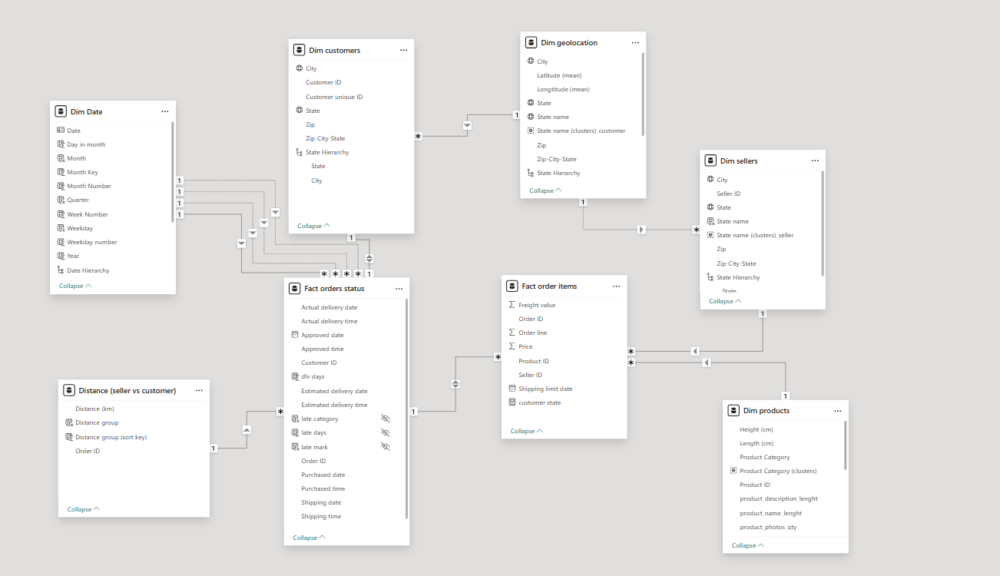
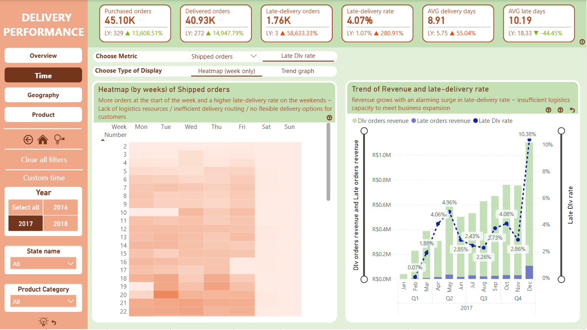
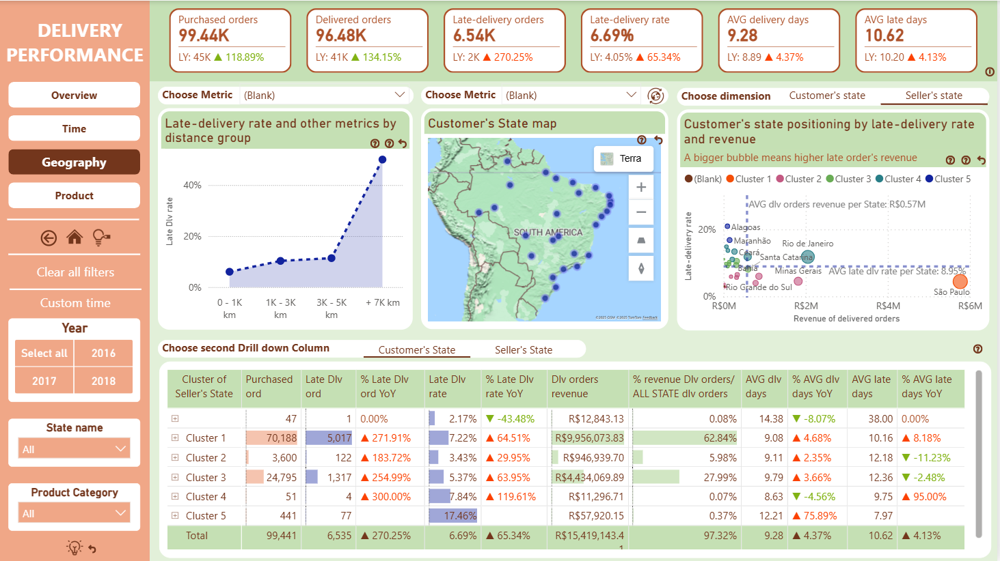

# 📦 Delivery Performance Analytics — Olist Store
*An analytics solution delivering root‑cause insights into delivery failures across time, geography, and product segments using Power BI and a Galaxy Schema data model.*

---

## 🔍 Executive Summary
This project provides a comprehensive assessment of delivery performance for Olist Store from 2016 to 2018.  
The analysis identifies operational bottlenecks, quantifies the revenue impact of late deliveries, and provides data‑driven recommendations for optimizing logistics capacity.

The report is designed as a tactical decision‑support tool for operations managers and analysts, focusing on:
- Performance anomalies  
- Operational inefficiencies  
- Risk concentration  
- Actionable interventions backed by data  

---

## 🧩 Business Context
Olist is a marketplace platform connecting sellers across Brazil with buyers nationwide.  
Between 2016 and 2018, rapid customer acquisition created delivery‑pressure spikes that resulted in:
- Increased late‑delivery rate  
- Regional delivery performance inconsistencies  

This project answers three main questions:
1. **What happened?**  
2. **Why did it happen?**  
3. **What should Olist do next?**

---

## 📅 Dataset Overview
- **Source:** [Kaggle](https://www.kaggle.com/datasets/olistbr/brazilian-ecommerce)
- **Timeframe:** 2016–2018  
- **Size:** ~100,000 orders  
- **Tables:** Customers, Sellers, Orders Status, Order Items, Products, Geolocation

---

## 🛠️ Technical Stack
- **Power BI** - Data modeling, DAX, dashboard design
- **Power Query** - ETL 

---

## 🧱 Data Modeling Architecture (Galaxy Schema)

### Entity‑Relationship Diagram

---

## 📊 Analytical Framework

### 1. Time Analysis
- Late‑delivery trends  
- Seasonality insights (rainfall season, holidays, other sales promotion events)  
- Weekend and weekday differences  
- Correlation between revenue surges & operational strain (defined by late-delivery orders and rate)

### 2. Geography Analysis
- State‑level delivery performance  
- Distance segmentation 
- Coastal vs inland operational risks  
- Weather‑driven & infrastructure‑driven patterns  

### 3. Product Analysis
- Volumetric weight vs delivery performance  
- Category‑level performance segmentation  
- Revenue concentration mapping  

---

## 💡 Key Insights

### Time
- Late deliveries peaked during weekends & the rainfall season (Nov–May).  
- April 2018 recorded the highest late‑delivery rate despite high demand.  
- Delivery delays strongly correlate with revenue spikes.

### Geography
- 0–1k km routes generate **80.46% of revenue** but show the **highest late‑day ratios of 40.14%**.  
- Coastal cities demonstrate higher weather‑related disruption risk.  
- Three states (São Paulo, Rio de Janeiro, Minas Gerais) contribute **62.74% of total revenue** with **a late-delivery rate of around 7.69%**.

### Product
- Higher volumetric weight leads to a higher late delivery rate.  
- Two priority clusters identified for logistics optimization.
    - Group 1 (Health Beauty, Watches Gifts, Bed Bath Table, Sports Leisure, Computers Accessories): **highest revenue** & **medium late-delivery rate (around 8.32%)**
    - Top 3 of group 2 (Housewares, Furniture Decor, Auto): **second-highest revenue** & **medium late-delivery rate (around 8.32%)**

---

## 🚀 Recommendations

### Regarding customer
- Provide flexible delivery window options  
- Enable proactive notifications during peak weather months  

### Regarding Internal Operations
- Enhance ETA forecasting with weather data   

### Regarding Logistics Partners
- Reallocate labor during seasonal spikes  
- Optimize warehouse flow for short‑distance deliveries 
- Prioritize top‑3 revenue states with capacity allocation  
- Implement performance scorecards for partners  
- Assign dedicated trucks for bulky / high‑volumetric shipments  

---

## 🖼️ Report Preview
👉 [Live Power BI report](https://app.powerbi.com/view?r=eyJrIjoiNjY3ZWFlNDYtNjlkYS00OGNiLWE4ZDgtMTgzNmQ5OGMzYmU3IiwidCI6ImFmMWYzNzUzLTM5MjUtNGU2Zi05NDliLTk3YzAwNzMyMDgwMyIsImMiOjEwfQ%3D%3D)

---

## 📥 Download PBIX File
The full Power BI report (.pbix) is available under **GitHub Releases**:

👉 https://github.com/hoaiphuong-clary411/Delivery-performance-of-Olist-Store/releases

---

## 👩‍💻 About Me
**Nguyễn Hoài Phương** — Data Analyst 
- Power BI · DAX · Data Modeling  
- Excel & VBA Automation
- Advanced SQL

📫 Contact  
- Email: hoaiphuong411hp@gmail.com 
